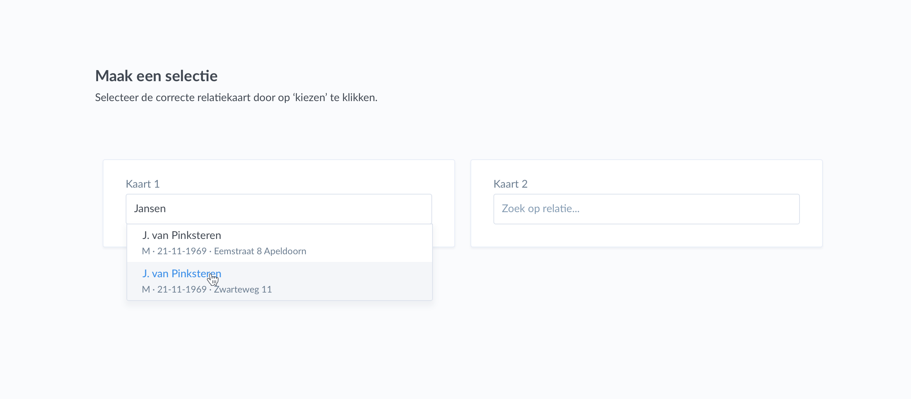
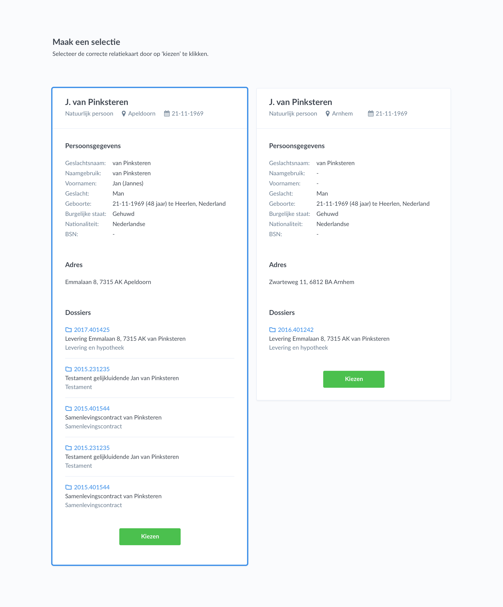

# Unicus
The frontend and backend of the Unicus application. The backend application is written in Kotlin, using the Spring Boot and KMongo framework. The frontend application is written in TypeScript, using the Angular framework.

This software is part of the 'Unicus' project, performed during the OOSE(Object Oriented Software Engineering)-project. Unicus provides a datacleansing solution for a notary application.

## Over Unicus (Dutch)
Unicus is een applicatie die gegevens uit een notariële database van de opdrachtgever kan doorzoeken en mogelijk dubbele records hieruit kan filteren. Hierbij wordt een eigen implementatie van het Levenshtein-algoritme gebruikt. Het presenteert deze resultaten aan de gebruiker welke vervolgens met deze applicatie de gevonden dubbele records kan samenvoegen tot 1 record

